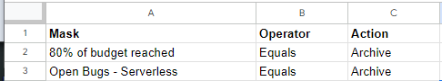

<!--Category:GAS--> 
 

    <a href="http://productivitytools.top/gmail-rules/"><a> 
    

    

# Gmail Rules

Google App Script that allows to filter gmail emails in more flexible way. 
<!--more-->

## How it is working

Google sheet should contain columns 
- Mask - pattern which we will compare the subject of the thread
- Operator 
  - Equals
  - StartsWith
  - Contains
  - From
- Action
  - Archive
  - Delete
- Label

## Important
- sheet needs to be named "Daily"
  

